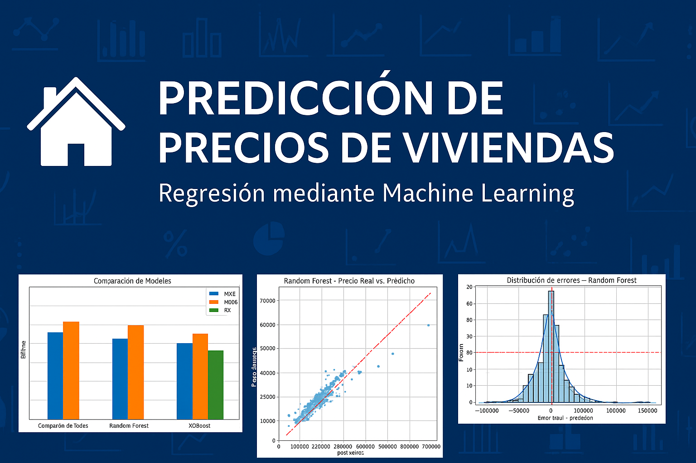
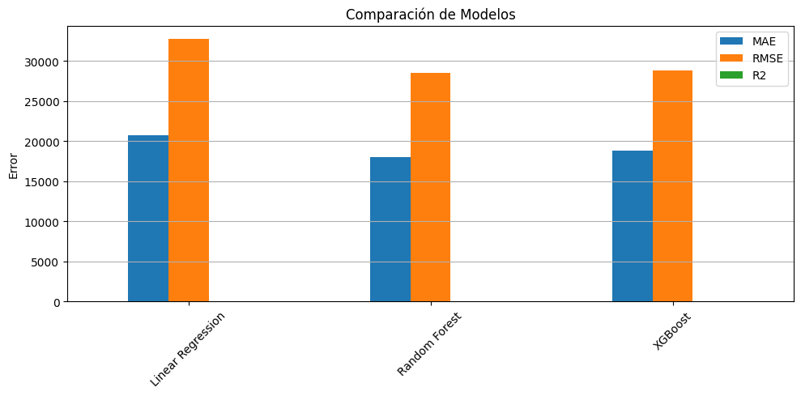
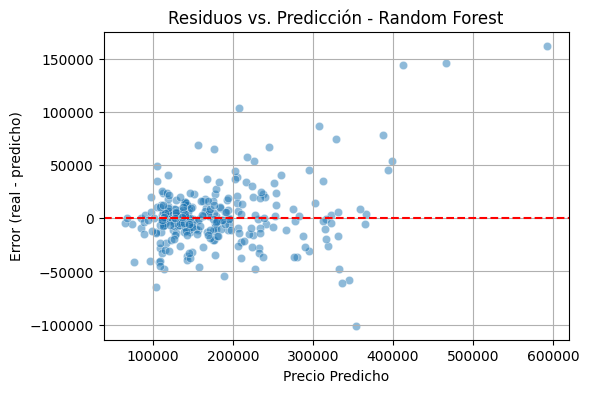

# 🏡 Predicción de Precios de Viviendas - Ames Housing

Este proyecto aplica algoritmos de **regresión supervisada** para predecir el precio de viviendas utilizando el famoso dataset *Ames Housing*. Se comparan varios modelos, se evalúan sus métricas y se analizan los errores.

---



---

## 📊 Dataset

- Fuente: [Ames Housing Dataset](https://www.kaggle.com/datasets/prevek18/ames-housing-dataset)
- Observaciones: 1.460 registros
- Objetivo: predecir el valor de la vivienda `SalePrice`
- Variables: número de habitaciones, superficie, calidad de materiales, año de construcción, ubicación, entre otras

---

## 🧠 Técnicas utilizadas

- Análisis exploratorio de datos (EDA)
- Limpieza y transformación de datos
- Codificación de variables categóricas (OneHot)
- Escalado de variables numéricas
- Entrenamiento de modelos de regresión:
  - Regresión Lineal
  - Random Forest
  - XGBoost
- Evaluación de modelos con métricas:
  - MAE (Error absoluto medio)
  - RMSE (Raíz del error cuadrático medio)
  - R² Score
- Visualización de errores y residuos

---

## ⚙️ Herramientas

`Python` | `Pandas` | `Scikit-learn` | `XGBoost` | `Matplotlib` | `Seaborn` | `Jupyter Notebook`

---

## 📈 Resultados y Visualizaciones

### Comparación de Modelos



---

### Predicción vs. Real (Random Forest)


---

### Distribución de errores (Random Forest)


---

### Residuos vs. Predicción (Random Forest)



---

## 📁 Estructura del Repositorio

```markdown
ames-housing-regresion/
├── ames_housing-regresion.ipynb    # Notebook principal del proyecto
├── README.md                       # Este archivo
├── requeriments.txt                # Librerías necesarias
├── .gitignore                      # Exclusiones de control de versiones
└── images/                         # Gráficos del análisis y resultados
```

🔗 Proyecto realizado por [Matías Vallone](https://github.com/ValloneMatias)
